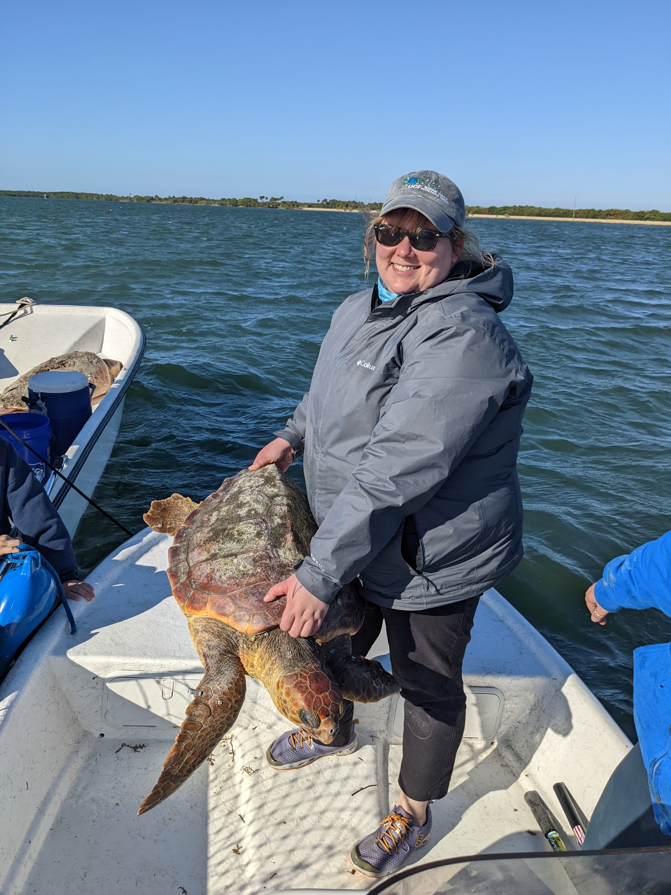

```{r, echo=F, warning=F, message=F}
if (!require("pacman")) install.packages("pacman")
pacman::p_load(knitr)
```


###

```{r, echo=FALSE, fig.cap="Hi! I am Estrella.", out.width = '30%', fig.align='center'}

```
   
<h6 style="text-align: center;" markdown="1">

Email: martin.katherine.rose[at] gmail [dot] com

</h6>     

I am an evolutionary biologist and PhD candidate in the Department of Biology at the University of Central Florida advised by Dr. Anna Savage and Dr. Kate Mansfield. My dissertation focuses on how sea turtle immune systems have evolved. I study the extraordinarily diverse major histocompatability complex (MHC) gene family and how it's evolved across sea turtle species, as well as gene expression across life stages, species, and disease status in sea turtles.
The body of my work is broadly motivated by understanding the patterns underlying the unique adaptations of reptiles and amphibians.


All photographs on this webpage are copyright of Katherine R. Martin, unless otherwise stated.
All sea turtle pictures are part of research permitted per FL MTP-171, FL MTP-231, FL MTP-225 , NMFS 19508, and predecessors.

----------------------------------

## Publications

<!-- <script type='text/javascript' src='https://d1bxh8uas1mnw7.cloudfront.net/assets/embed.js'></script> -->

##

5. _Castellanos FX, Moreno-Santillan D, Hughes GM, Paulat NS, Sipperly N, Brown A, **Martin KR**, Poterewicz GM, Lim MCW, Russell AL, Moore MS, Johnson M, Corthals AP, Ray D, Davalos LM  (2023)_ The evolution of antimicrobial peptides in Chiroptera. _Frontiers in Immunology_ [*PDF*](https://www.frontiersin.org/journals/immunology/articles/10.3389/fimmu.2023.1250229/full)
<!-- <div class='altmetric-embed' data-badge-popover="right" data-badge-type='medium-bar' data-doi="10.3389/fimmu.2023.1250229"></div> -->

4. _Phillips KF, **Martin KR**, Stahelin GD, Savage AE, Mansfield KL  (2022)_ Genetic variation among sea turtle life stages and species suggests connectivity among ocean basins. _Ecology and Evolution_ [*PDF*](https://onlinelibrary.wiley.com/doi/pdf/10.1002/ece3.9426)
<!-- <div class='altmetric-embed' data-badge-popover="right" data-badge-type='medium-bar' data-doi="10.1002/ece3.9426"></div> -->

3. _Lafond J, **Martin KR**, Dahn H, Richmond JQ, Murphy RW, Rollinson N, Savage AE   (2022)_ Invasive bullfrogs maintain MHC polymorphism including alleles associated with chytrid fungal infection. _Integrative and Comparative Biology_ [*PDF*](https://academic.oup.com/icb/article/62/2/262/6589410)
<!-- <div class='altmetric-embed' data-badge-popover="right" data-badge-type='medium-bar' data-doi="10.1093/icb/icac044"></div> -->

2. _**Martin KR**, Mansfield KL, Savage AE  (2022)_ Adaptive evolution of MHC class I immune genes and disease associations in coastal juvenile sea turtles. _Royal Society Open Science_ [*PDF*](https://royalsocietypublishing.org/doi/full/10.1098/rsos.211190)
<!-- <div class='altmetric-embed' data-badge-popover="right" data-badge-type='medium-bar' data-doi="10.1098/rsos.211190"></div> -->

1. _Karwacki EE, **Martin KR**, Savage AE  (2022)_ ). One hundred years of infection with three global pathogens in frog populations of Florida, USA. _Biological Conservation_ [*PDF*]()
<!-- <div class='altmetric-embed' data-badge-popover="right" data-badge-type='medium-bar' data-doi="10.1016/j.biocon.2021.109088"></div> -->
